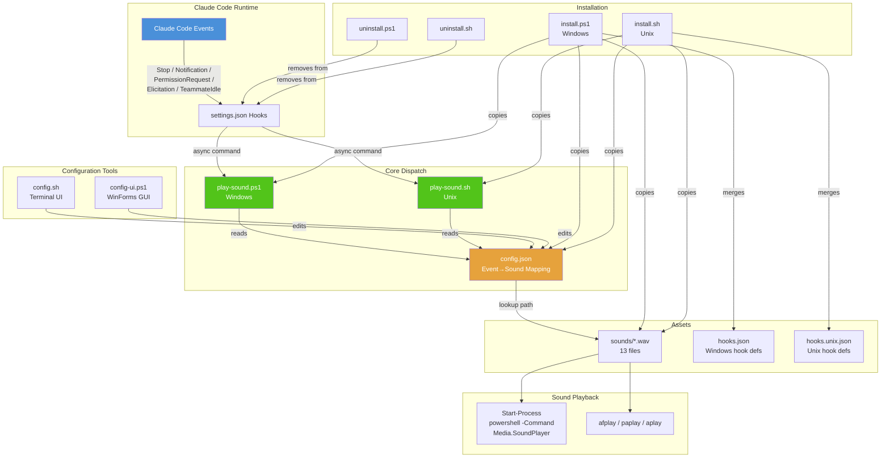

# DingDong Architecture



## Data Flow

```
Claude Code Event
    │
    ▼
settings.json hook entry  ─── reads matcher ─── match? ─── yes ──→ async command
    │                                                                   │
    │                                                                    ▼
    │                                               play-sound.ps1/.sh -Event <name>
    │                                                                   │
    │                                                                    ├── reads config.json
    │                                                                    ├── look up sound path by event key
    │                                                                    ├── validate file exists → silent exit if not
    │                                                                    └── play WAV:
    │                                                                         Windows: Start-Process powershell → Media.SoundPlayer.PlaySync()
    │                                                                         macOS:   afplay
    │                                                                         Linux:   paplay → aplay (fallback)
    ▼
   done (no feedback to Claude Code — async: true)
```

## File Dependency Graph

```
hooks.json / hooks.unix.json
    └── references → play-sound.ps1 / play-sound.sh (via command string)

play-sound.ps1
    ├── reads → config.json
    └── spawns → powershell -Command Media.SoundPlayer

play-sound.sh
    ├── reads → config.json (via jq / python3)
    └── calls → afplay / paplay / aplay

config.sh  (TUI)
    ├── reads → config.json
    ├── reads → sounds/*.wav (for listing)
    ├── writes → config.json
    └── calls → afplay / paplay / aplay / powershell (preview)

install.ps1
    ├── copies → play-sound.ps1 → target dir
    ├── copies → config.json → target dir
    ├── copies → sounds/*.wav → target dir/sounds/
    ├── reads → hooks.json (hook definitions)
    ├── reads/writes → settings.json (merge hooks)
    └── resolves ${CLAUDE_PLUGIN_ROOT} → absolute paths

install.sh
    ├── copies → play-sound.sh → target dir
    ├── copies → config.json → target dir
    ├── copies → sounds/*.wav → target dir/sounds/
    ├── reads → hooks.unix.json (hook definitions)
    └── writes → settings.json (via python3)

uninstall.ps1
    ├── reads → settings.json
    ├── scans hooks for DingDong entries (by command string matching)
    └── removes → matching entries from settings.json

uninstall.sh
    ├── reads → settings.json
    └── removes → hooks section entirely
```

## Install-Time Flow

```
                   install.ps1 / install.sh
                           │
               ┌───────────┴───────────┐
               ▼                       ▼
         Copy files              Register hooks
               │                       │
               ▼                       ▼
      plugin root/                settings.json
      ├── play-sound.ps1/.sh     "hooks": { ... }
      ├── config.json
      └── sounds/*.wav
```

## Event → Sound Mapping (config.json default)

| Event | Matcher | Default Sound | File |
|-------|---------|---------------|------|
| Stop | `*` | `denielcz-done_01.wav` | hooks on all stop events |
| Notification | `(?i)task.?complet\|done\|finished\|completed` | `pop.wav` | Only on completion keywords |
| PermissionRequest | `Bash\|Write\|Edit\|Read` | `notify-descend.wav` | Only on tool permission requests |
| Elicitation | `.*` | `question-double.wav` | All clarifications |
| TeammateIdle | `.*` | `null` (silent) | All idle events |
| PreToolUse | `AskUserQuestion` | (→ Elicitation sound) | Alternative elicitation trigger |
| SubagentStop | `.*` | (→ Notification sound) | Alternative notification trigger |

## Platform Comparison

| Aspect | Windows | Unix (macOS/Linux) |
|--------|---------|-------------------|
| **Entry point** | `play-sound.ps1` | `play-sound.sh` |
| **Hook defs** | `hooks.json` | `hooks.unix.json` |
| **Config reader** | `ConvertFrom-Json` (PowerShell native) | `jq` → `python3` (fallback) |
| **Sound player** | `Start-Process` → `Media.SoundPlayer::PlaySync()` | `afplay` (macOS) / `paplay` (Linux) / `aplay` (fallback) |
| **Installer** | `install.ps1` | `install.sh` |
| **Config UI** | `config-ui.ps1` (WinForms) | `config.sh` (terminal TUI) |
| **Uninstall** | `uninstall.ps1` (scans + removes specific entries) | `uninstall.sh` (removes whole hooks section) |

## Key Design Decisions

1. **Wrapper script pattern**: hooks.json points to `play-sound.ps1` which reads `config.json` — users change sounds by editing one JSON file, not settings.json
2. **Async hooks**: All hooks use `"async": true` + `"timeout": 10` — sound never blocks Claude Code
3. **Zero dependencies**: Pure shell + PowerShell + built-in OS audio tools — no npm/pip/gem
4. **Silent exit on error**: If config.json missing, event not found, or sound file missing → `exit 0` — no error noise
5. **One process hop**: Start-Process for Windows audio creates isolated audio context (fixes hook background process audio issue)
6. **Portable config**: Paths in config.json are relative — plugin root is resolved at runtime by the script

## Project File Tree

```
dingdong/
├── play-sound.ps1        # Windows entry point
├── play-sound.sh          # Unix entry point
├── config.json            # Event → WAV file mapping
├── config.sh              # Terminal UI configurator (cross-platform)
├── hooks.json             # Windows hook definitions
├── hooks.unix.json        # Unix hook definitions
├── CLAUDE.md              # Project instructions
├── .gitignore
├── .claude-plugin/
│   ├── plugin.json        # Plugin metadata (v0.0.5)
│   └── marketplace.json   # Marketplace listing
├── scripts/
│   ├── install.ps1        # Windows installer
│   ├── install.sh         # Unix installer
│   ├── uninstall.ps1      # Windows uninstaller
│   └── uninstall.sh       # Unix uninstaller
└── sounds/                # 13 WAV files
    ├── alert.wav
    ├── beep-soft.wav
    ├── denielcz-done_01.wav
    ├── ding.wav
    ├── done-classic.wav
    ├── done-fanfare.wav
    ├── done-soft.wav
    ├── error.wav
    ├── notify-descend.wav
    ├── pop.wav
    ├── question-double.wav
    ├── question-rising.wav
    └── warning.wav
```
